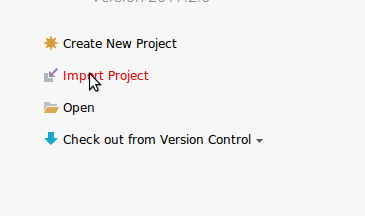
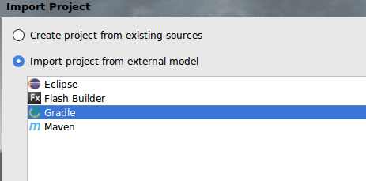
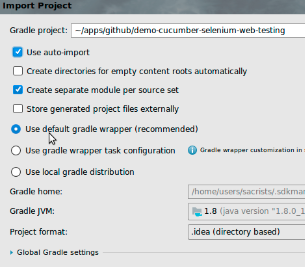

# demo-Web-testing-with-Selenium
Project to test Serenity with Selenium and Cucumber

## Configuration
* This is a gradle project, you can import it from your favorite IDE as Gradle project.
* From IntelliJ
*
 * 

 * 

 * 


* To verify that all is up to date with dependencies and test compilation, execute the gradle task: _testClasses_
* Before execute the tests, execute the gradle task: _downloadChromeDriverServer_

## Before start coding

* Read the [Java Naming Conventions](http://www.oracle.com/technetwork/java/codeconventions-135099.html)

And take care of:
* Methods in well-designed object-oriented code are short. Strive to keep methods less than 10 lines. Reconsider methods that are over a page in length, breaking them into several methods representing smaller blocks of functionality.
* Break up long methods into small methods. This promotes code reuse and allows for more combinations of methods. If the number of methods grows to be difficult to understand, then look at decomposing the class into more than one class.
* Follow the 30-second rule. Another programmer should be able to look at your method and fully understand what it does, why it does it and how it does it in less than 30-seconds. If that is not possible, then your code is too complex and difficult to maintain. A good rule of thumb is that a method should be no more than a screen in length.
* Keep it simple
* Avoid nesting blocks of statements more than 2 or 3 levels deep. This adds to the complexity of the code. A method should be easy to read and understand. Easy to maintain is the goal.
* Avoid nesting method calls too deeply, since this can introduce undue complexity.
* Avoid using compound predicates:

     if (x>0 && x<100 && y>0 && y<100 || z==1000)

     Think of all the combinations you will have to write to adequately test the above condition (2^5 or 32 different combinations).

## Best practices:

* Every day: Revisit, Refactor, and Improve -> leave 'things' better than you find them --> Invest 5 minutes every day

* Never write anything if it is not necessary.
  For example, do not define elements in a page object that we may not use.

 * Always use the serenity WebElementFacade instead of the WebElement of Selenium
 * To find elements use:
   * @Find(..):

* Use functional names when possible (vs use html names). Example:
  * BAD: "clickBtnGetStatus"            
  * OK: "showStatus"

* Selenium framework encapsulated in PageObject.

    So to access a text field you should have an accessor method that takes and returns a string, check boxes should use booleans, and buttons should be represented by action oriented method names.
    
    In general page object operations should return fundamental types (strings, dates) or other page objects.
    
     We should not use assertions in page objects
    
     See http://martinfowler.com/bliki/PageObject.html:
    ***"Having page objects be responsible for creating other page objects in response to things like navigation is common advice. However some practitioners prefer that page objects return some generic browser context, and the tests control which page objects to build on top of that context based on the flow of the test (particularly conditional flows). Their preference is based on the fact that the test script knows what pages are expected next and this knowledge doesn't need to be duplicated in the page objects themselves."***
    
    --> In our case we use IOC to inject pages, so we don't usually need to retun a PageObject from a PageObject. 

    Example:
    * BAD:
    ```java
        @Step
        public void clickBtnIsModified() {
            liSjsonListBoxSelectorPage.getBtnIsModified().click(); --> we are expossing de WebElement 'BtnIsModified'
        }
    ```
    * OK:
    ```java
            @Step
            public void clickBtnGetSelected() {
                liSjsonListBoxSelectorPage.checkSelected();
            }
    ```

* Never put a call of a method inside an Assert, it has different timeout. Example:
    * BAD:
    ```java
            Assert.assertNotNull("Error popup must appear",popupWidget.isDisplayed());
    ```
    * OK:
    ```java
            boolean isPopupDisplayed = popupWidget.isDisplayed()
            Assert.assertTrue("Error popup must appear",isPopupDisplayed);
    ```

* When put @Step? Only if required! On every @Step Serenity will take two screenshots, one before the execution and the other after the execution. Example:
    * BAD:
    ```java
            @Step
            public void clickBtnIsModified() {
                liSjsonListBoxSelectorPage.getBtnIsModified().click();
            }
    ```
    * OK:
    ```java
            public void clickBtnGetSelected() {
                liSjsonListBoxSelectorPage.checkSelected();
            }
    ```
        
* Selectors approach. In order of preference:
    * By id. Example: ``` private WebElement btnOK; ```            
    * By name (if it is unique).Example:
    ```java
            @FindBy(name="btnG")
            WebElement searchButton;
    ```   
    * By cssSelector:  https://saucelabs.com/resources/articles/selenium-tips-css-selectors. Example:
        ```java    
          @FindBy(css = ".Appcombo_menu")
          private WebElementFacade appcomboMenu;
 
          @FindBy(css = td[zentext='hola']
          private WebElementFacade hola;
        ```   
* Allways "optimize imports" --> IntelliJ settings

* Injection of components (pages extends a PageObject) without any annotation. Example: 

* Use LOGGER to log details of the execution:
    ```java 
        private static final Logger LOGGER = LoggerFactory.getLogger(MethodHandles.lookup().lookupClass());
    ```
        
* Om every page put this method as template:
    ```java
        @WhenPageOpens
        public boolean isLoaded() {
            boolean answer = true;
            try {
                // TODO locate the las element in the page
                //$.switchToFrame(IFRAME);
            } catch (Exception exception){
                LOGGER.debug("Page is not loaded");
                answer = false;
            }
            return answer;
        }
    ```
* All the asserts should be only in StepsDefinitions classes, and using: org.assertj.core.api.Assertions.assertThat
    @See: http://joel-costigliola.github.io/assertj/

* Finding improvements:
    ```java
        StepDef:
            private LISjsProviderPage liSjsProviderPage;

            @Steps
            private LISjsProviderSteps lisjsProviderSteps;

            @Then("^verify 'Success' and 'Always' callbacks executed$")
            public void verifyAndCallbacksExecuted() {
                Assert.assertTrue(lisjsProviderSteps.getResultSuccessAlways().contains("Succes")
                        && lisjsProviderSteps.getResultSuccessAlways().contains("Always"));
            }
        Step:
            public String getResultSuccessAlways() {
                return liSjsProviderPage.getResultSuccessAlways();
            }

        Page:
            private static final String RESULT_200_OUTPUT_FIELD = "div[id='partialResult200']";

            public String getResultsSuccessAlways() {
                return $.byCSSSelector(RESULT_200_OUTPUT_FIELD).getText();
            }
    ```                
    Result:
    * The step is not needed
    * Only one access to the browser
    * AseertJ use
    ```java
        StepDef:
			private LISjsProviderPage liSjsProviderPage;
			
            @Then("^verify 'Success' callback executed$")
            public void verifySuccessCallbacksExecuted() {
                String actual = liSjsProviderPage.getSuccessCallback();
                assertThat(actual).contains(SUCCES).contains(ALWAYS);
            }
        Page:
            private WebElementFacade partialResult200;

            public String getSuccessCallback() {
                return partialResult200.getText();
            }
    ```  

* Components that we can use from Serenity: Dropdown, HtmlTable, FileToDownload,FileToUpload

    ``` @see net.thucydides.core.pages.components ```

* Use: FindBy of Serenity:
        import net.serenitybdd.core.annotations.findby.FindBy;


# Execution
gradle test -Dcucumber.options="--tags @uno"
